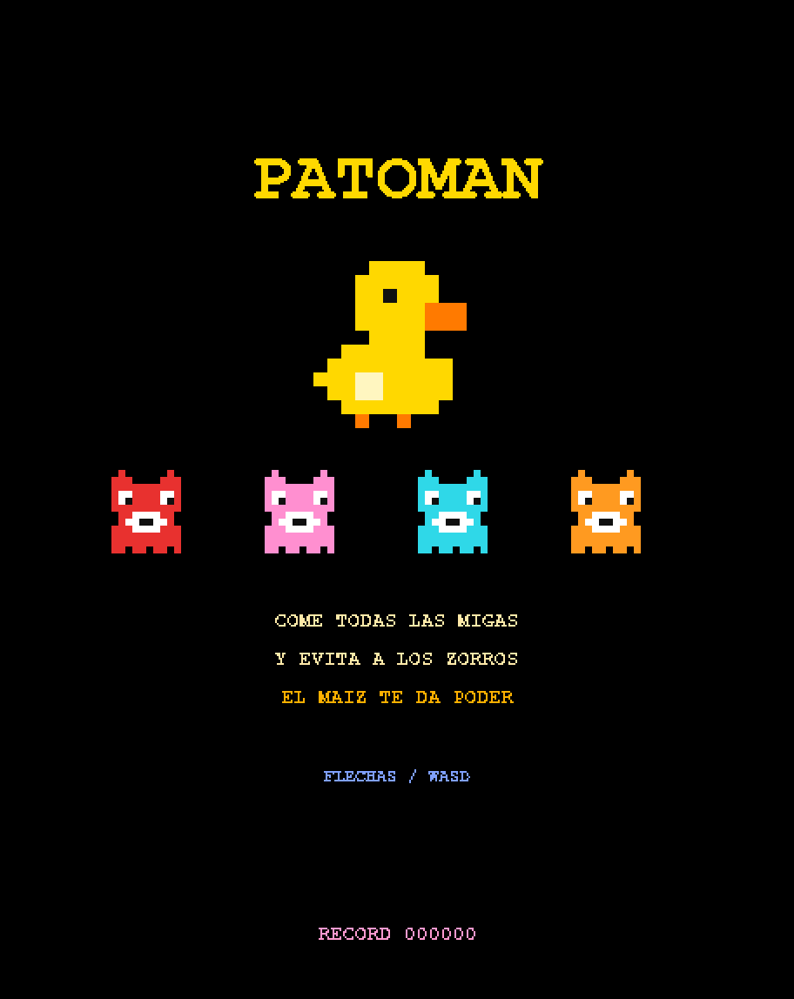
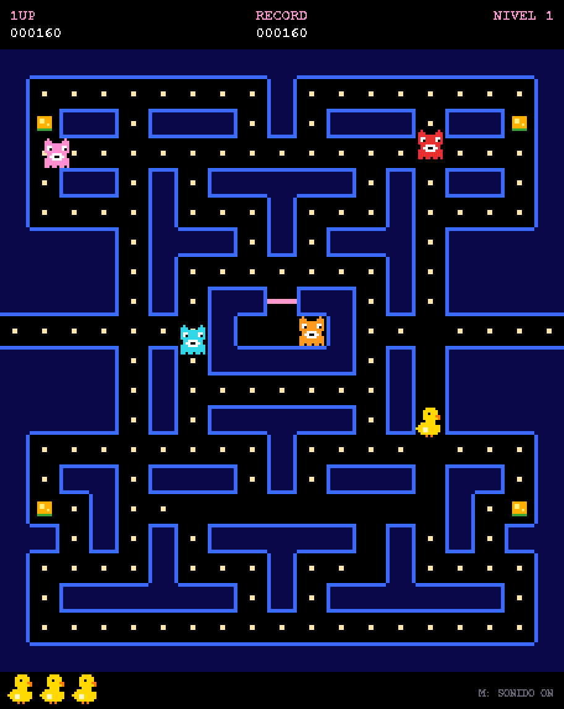
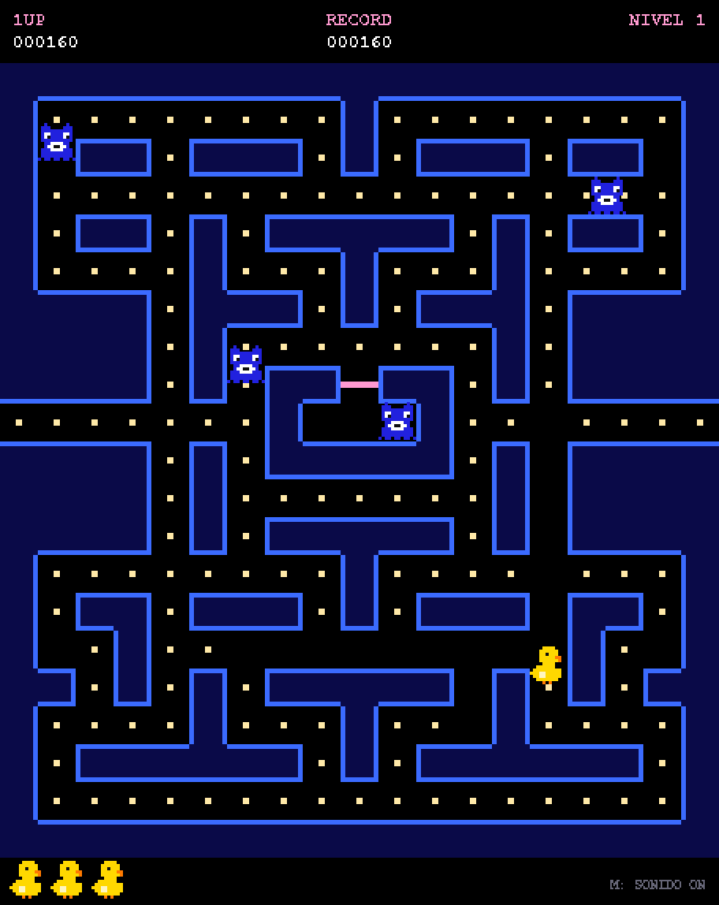
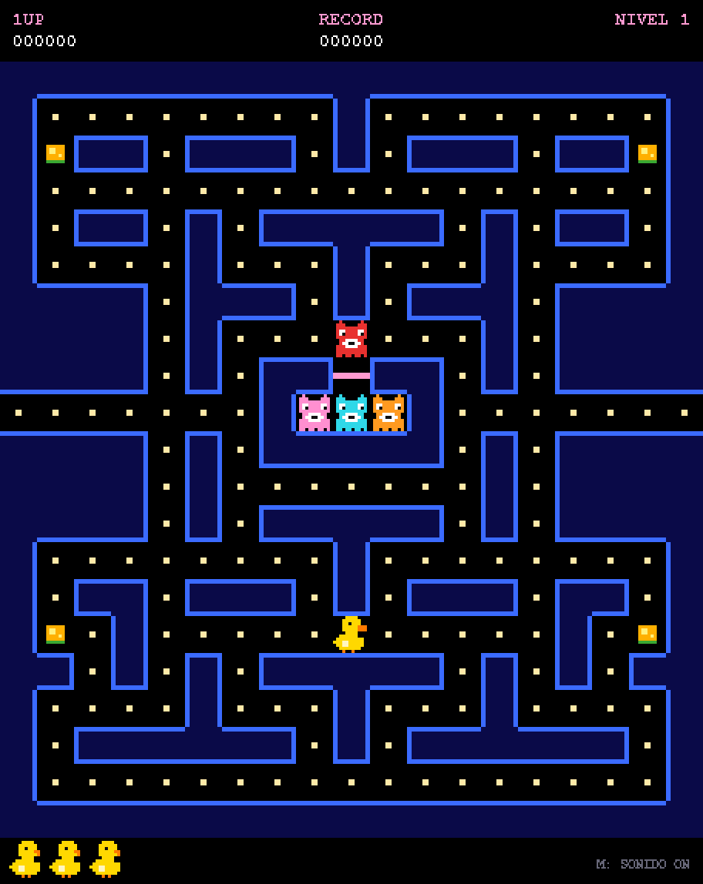
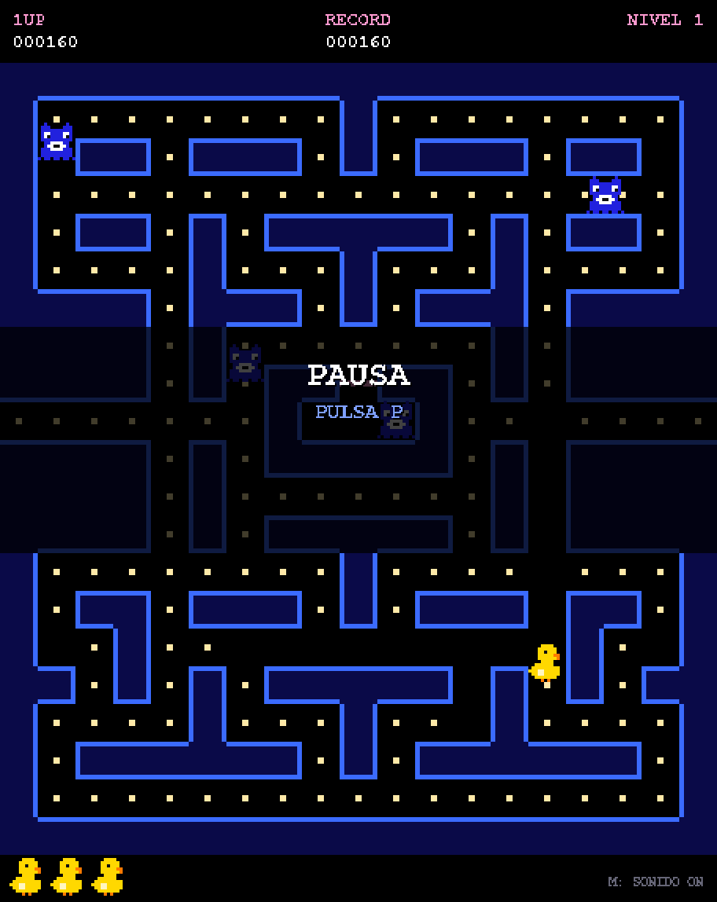
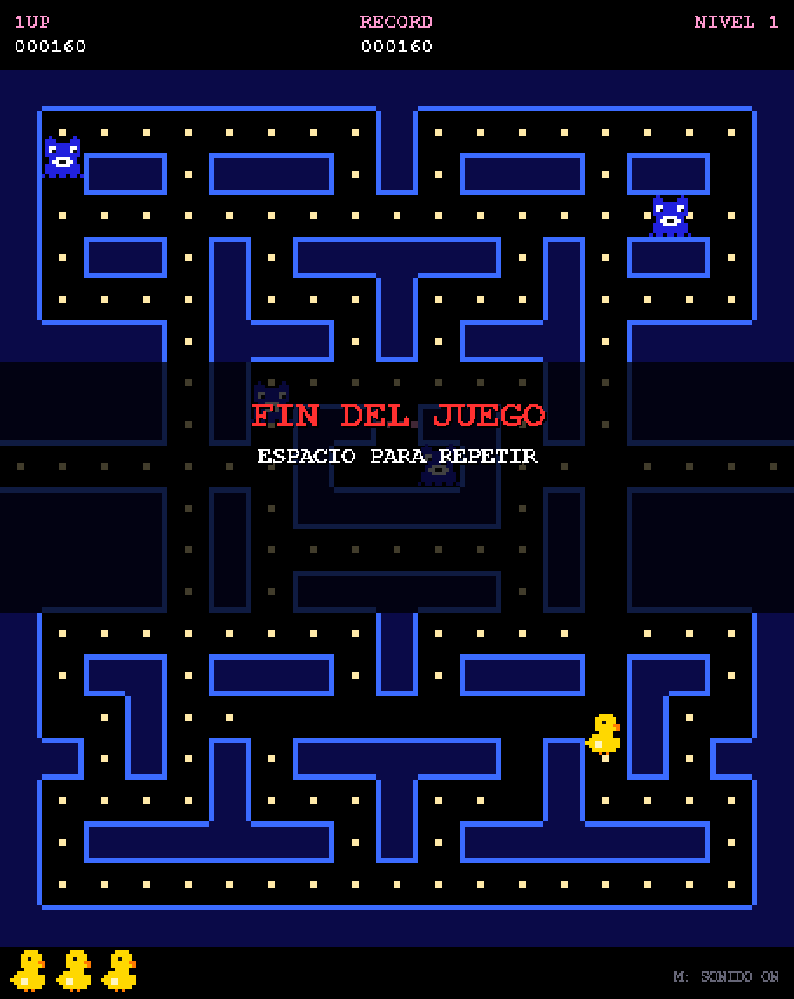
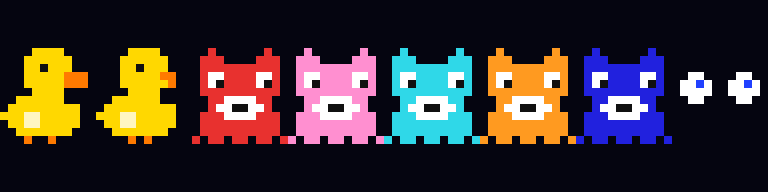

# 🦆 PATOMAN

Un juego estilo **Pac-Man** en **pixel art retro**, pero con un patito que se come las migas de pan
mientras huye de cuatro zorros. Hecho en Python con [pygame-ce](https://pyga.me/).

<p align="center">
  
  
</p>

## Instalación y ejecución

Necesitas Python 3.9 o superior.

```bash
git clone <url-del-repositorio>
cd pac-man-demopato

python3 -m venv .venv
.venv/bin/pip install pygame-ce     # en Windows: .venv\Scripts\pip install pygame-ce

.venv/bin/python patoman.py         # en Windows: .venv\Scripts\python patoman.py
```

> Se usa `pygame-ce` (fork comunitario de pygame) porque `pygame` clásico todavía no
> publica ruedas para las versiones más recientes de Python.

También hay una versión web del mismo juego: abre `index.html` en cualquier navegador.

## Manual del jugador

### Objetivo

Guía al pato por el laberinto y cómete **todas las migas** para pasar de nivel. Si un zorro te
toca, pierdes una vida. Tienes **3 vidas**; cuando se acaban, termina la partida.

### Controles

| Acción                    | Teclas                        |
| ------------------------- | ----------------------------- |
| Mover (izq / der / arr / abajo) | Flechas **o** `A` `D` `W` `S` |
| Empezar / reiniciar       | `Espacio` o `Enter`           |
| Pausa                     | `P`                           |
| Sonido on / off           | `M`                           |
| Pantalla completa         | `F`                           |
| Salir                     | `Esc`                         |

El pato sigue la última dirección que pidas en cuanto el camino esté libre, así que puedes
adelantarte pulsando la dirección antes de llegar a la esquina. Dar la vuelta es instantáneo.

### Puntuación

| Elemento                      | Puntos                          |
| ----------------------------- | ------------------------------- |
| Miga de pan                   | 10                              |
| Maíz (poder)                  | 50                              |
| Zorro asustado (1.º, 2.º, ...) | 200, 400, 800, 1600             |

El **récord** se guarda automáticamente en el archivo `.patoman-hi`.

### Los zorros

Cada zorro persigue de una forma distinta:

| Zorro    | Comportamiento                                      |
| -------- | --------------------------------------------------- |
| 🟥 Rojo    | Te persigue directamente.                           |
| 🩷 Rosa    | Intenta cortarte el paso, apuntando delante de ti.  |
| 🟦 Azul    | Rodea el mapa de forma errática.                    |
| 🟧 Naranja | Te persigue de lejos y se esconde en su esquina si te acercas. |

Los zorros alternan entre **dispersarse** hacia sus esquinas (7 s) y **cazarte** (20 s). Salen de
la madriguera central de uno en uno, y con cada nivel son más rápidos.

### El maíz 🌽

Las cuatro mazorcas parpadeantes de las esquinas dan poder al pato:

<p align="center">
  
</p>

- Los zorros se ponen **azules** y huyen al azar, más despacio.
- Puedes **comértelos**: solo quedan sus ojos, que vuelven corriendo a la madriguera para revivir.
- Cuando el efecto está por acabar, los zorros **parpadean en blanco**. ¡Date prisa!
- El efecto dura menos en cada nivel.

### Consejos

- Usa el **túnel lateral** (fila central) para perder a los zorros: sales por un lado y apareces por el otro.
- Come las migas de las zonas peligrosas primero y deja los pasillos cercanos a la madriguera para el final.
- Guarda el maíz para cuando haya zorros cerca; encadenar los cuatro vale 3000 puntos.

### Pantallas

<p align="center">
  
  
  
</p>

| Pantalla         | Qué ocurre                                                       |
| ---------------- | ---------------------------------------------------------------- |
| **¡LISTO!**      | Cuenta atrás al empezar cada vida o nivel.                       |
| **PAUSA**        | `P` congela el juego.                                            |
| **FIN DEL JUEGO**| Sin vidas. Pulsa `Espacio` para volver a jugar.                  |

## Personajes

<p align="center">
  
</p>

De izquierda a derecha: el pato (pico abierto y cerrado), los cuatro zorros, un zorro asustado y los
ojos de un zorro comido. Todos los sprites son de 12×12 píxeles y están definidos como texto
directamente en el código (`patoman.py`).

## Estructura del proyecto

```
patoman.py   # el juego (Python + pygame-ce)
index.html   # misma versión del juego para el navegador
docs/        # capturas e imágenes usadas en este README
```
